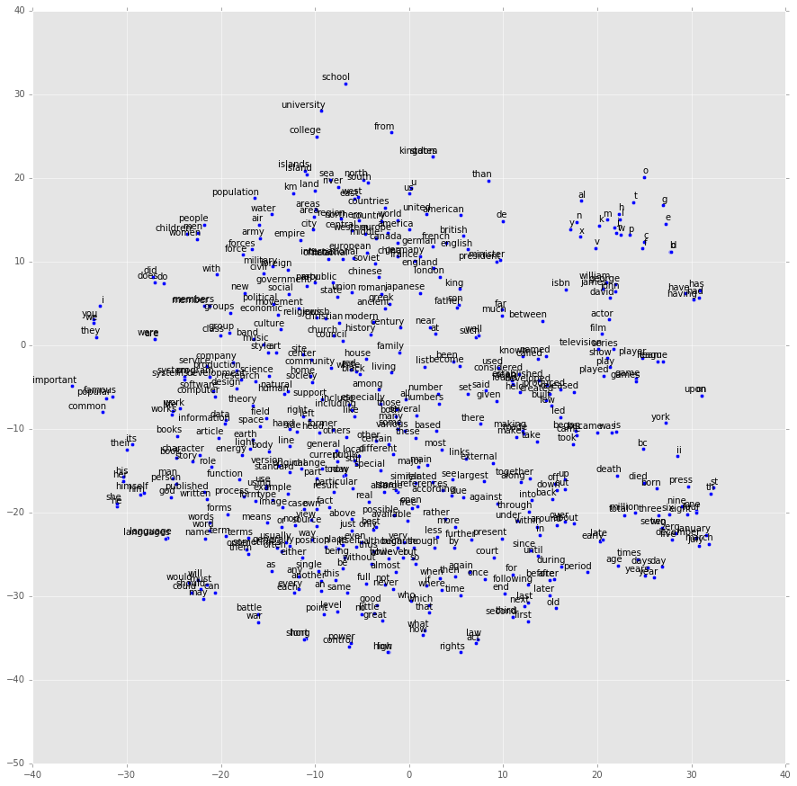

## 描述

[自然语言处理](https://en.wikipedia.org/wiki/Natural_language_processing)（后面简称NLP）是机器学习技术重要应用范畴之一，从手机上的智能语音助理如Siri，到移动、联通的自动语音服务，再到具有理解、推理能力的[IBM Waston](http://www.ibm.com/watson/)，最近亚马逊也相应推出了可提供高级语音识别及自然语言理解功能的[Lex](https://aws.amazon.com/cn/lex/)，这些都是自然语言处理技术应用前沿产品实例。 试想，如果有朝一日人类完全解决自然语言处理瓶颈，实现计算机对自然语言完全理解、分析，那么出现在科幻片如《机械姬》、《西部世界》里面的机器人与人类无障碍沟通及情感交流的情景很可能出现。

​但是现实中自然语言处理技术层面还面临诸多挑战，其中之一就是词、语句以及文章的表达。在日常生活中，最常见的词语表述方式比如”cat“、”dog“，这些都是利用符号表示意思。统计语言处理里面，比较容易利用符号来描述概率模型，比如[ngram模型](http://blog.csdn.net/ahmanz/article/details/51273500) ，计算两个单词或者多个单词同时出现的概率，但是这些符号难以直接表示词与词之间的关联，也难以直接作为机器学习模型输入向量。对句子或者文章的表示，可以采用[词袋子模型](http://www.cnblogs.com/platero/archive/2012/12/03/2800251.html)，即将段落或文章表示成一组单词，例如两个句子：”She loves cats.“、”He loves cats too.“ 我们可以构建一个词频字典：{"She": 1, "He": 1, "loves": 2 "cats": 2, "too": 1}。根据这个字典, 我们能将上述两句话重新表达为下述两个向量: [1, 0, 1, 1, 0]和[0, 1, 1, 1, 1]，每1维代表对应单词的频率。

​近几年来，借助深度学习概念和性能强劲的硬件平台，Geofrey Hinton, Tomas Mikolov, Richard Socher等学者深入开展了针对词向量的研究，进行了大量鼓舞人心的实验，将自然语言处理推向了新的高度。以词向量为基础，可以方便引入机器学习模型对文本进行分类、情感分析、预测、自动翻译等。最简单的词向量就是独热编码(one-hot encoder)，比如有三个单词“man"、”husband“、”dog“，将之分别表示为[0,0,1]，[0,1,0]，[1,0,0]，这些词向量可以作为机器学习模型的输入数值向量，但是它们依然难以表达关联性，而且当词库单词量庞大时，独热编码的维度也会十分巨大，给计算和存储带来不少问题。Mikolov、Socher等人提出了[Word2Vec](http://papers.nips.cc/paper/5021-distributed-representations-of-words-and-phrases-and-their-compositionality.pdf)、[GloVec](http://nlp.stanford.edu/pubs/glove.pdf)等词向量模型，能够比较好的解决这个问题，即用维数较少的向量表达词以及词之间的关联性。关于这些词向量模型的具体原理，可以阅读他们所发表的论文，主要是英文，中文网站上也出现了不少精彩的翻译和解读，可以参考某些关于自然语言处理的[中文博客](http://www.52nlp.cn/%e6%96%af%e5%9d%a6%e7%a6%8f%e5%a4%a7%e5%ad%a6%e6%b7%b1%e5%ba%a6%e5%ad%a6%e4%b9%a0%e4%b8%8e%e8%87%aa%e7%84%b6%e8%af%ad%e8%a8%80%e5%a4%84%e7%90%86%e7%ac%ac%e4%ba%8c%e8%ae%b2%e8%af%8d%e5%90%91%e9%87%8f)。

​类似的，句子、段落以及文章也可以引入向量的概念进行表达，称之为Doc2Vec，有兴趣的可以拜读Mikolov的论文[《Distributed Representations of Sentences and Documents》](https://arxiv.org/pdf/1405.4053v2.pdf)。

​本项目目的就是利用上述自然语言处理技术结合所学机器学习知识对文档进行准确分类。

## 数据

​分类文本数据可以使用经典的20类新闻包，里面大约有20000条新闻，比较均衡地分成了20类，是比较常用的文本数据之一。既可以从[官方网站](http://www.qwone.com/~jason/20Newsgroups/)下载，也可利用*sklearn*工具包下载，具体请参见[说明文档](http://scikit-learn.org/stable/datasets/twenty_newsgroups.html)。

​此外，词向量的训练也需要大量数据，如果感觉20类新闻数据样本量不足以训练出较好的词向量模型，可以采用Mikolov曾经使用过的[text8](http://mattmahoney[.NET](http://lib.csdn.net/base/dotnet)/dc/text8.zip)数据包进行训练。

## 任务：

- （1）探索文本表示的方式

  - 使用词袋子模型来表示每篇文档，常见的一种思路是首先将文本进行分词，也就是将一个文本文件分成单词的集合，建立词典，每篇文档表示成特征词的频率向量或者加权词频[TF-IDF](http://baike.baidu.com/link?url=toXJqDyZ1smDK2HpzusBzUnWX6YlKffU9bigEa5DHEOHmF0pL6XsDlhbzF10sijRGPeeml5Ze3cOtGAIHLXT0_)向量，这样可以得到熟悉的特征表。接下来，就可以方便利用机器学习分类模型进行训练。如下面所示意：

    ```
    	                   She	He	loves cats dogs	 too
    "She loves cats."	    1	 0	  1	   1	0	 0
    "He loves cats too."	0	 1	  1	   1	0	 1
    "She loves dogs."	    1	 0	  1	   0	1	 0

    ```
  - 利用Word2Vec方式即词向量模型表示每篇文档，这里面包含两部分主要工作：
    
     - 利用文本数据对词向量进行训练，将每个单词表示成向量形式。词向量训练后需要进行简单评测，比如检验一些单词之间相似性是否符合逻辑，下图是我在text8数据上训练的词向量模型，其中"school"、“university"、”college“三个意义比较类似的词基本上聚在一起。
    
     - 探讨怎样用文档中每个词的向量来表达整个文档。学有余力的同学还可以尝试Dov2Vec的模型来直接训练表示每篇文档。

- （2）分别在词袋子、词向量表达基础上采用你认为适当的模型对文本分类，优化模型并分析其稳健性。


## 模型

​文本表示模型在前面已经谈到，这里不作赘述。 注意文本预处理方式可能对最终结果有影响，对于某些语言比如英文，是否要考虑区分单词大小写、是否要对同一词不同形式（如单复数）进行统一、是否要保留标点符号？这些讨论都应该反映在报告中。

​下列分类模型可供参考：

- 决策树模型
- 支持矢量机(SVM)模型
- 朴素贝叶斯模型
- 神经网络模型

## 要求

具体项目报告要求请参见优达学城毕业项目说明，https://github.com/nd009/machine-learning。

## 工具

建议使用的工具包：

- [gensim](http://radimrehurek.com/gensim/)，可以方便快捷地训练Word2Vec词向量。
- [GloVec](https://github.com/maciejkula/glove-python)，可以用来训练GloVec词向量。
- [sklearn](http://scikit-learn.org/)，功能强大的机器学习包，包含有常用的分类工具。
- [tensorflow](http://www.tensorfly.cn/)，可以逐步定义词向量训练过程，也可以建立深度学习建模。

# 参考文献

1. 维基百科，自然语言处理，https://en.wikipedia.org/wiki/Natural_language_processing
2. 我爱自然语言处理，中英文维基百科语料上的Word2Vec实验，http://www.52nlp.cn/tag/word2vec
3. 优达学城，机器学习毕业项目说明，https://github.com/nd009/machine-learning
4. 牛津大学，自然语言处理和深度学习课程， https://github.com/oxford-cs-deepnlp-2017/lectures
5. 斯坦福大学，自然语言处理和深度学习课程，http://cs224d.stanford.edu/
6. 哥伦比亚大学，自然语言处理课程，http://www.cs.columbia.edu/~mcollins/